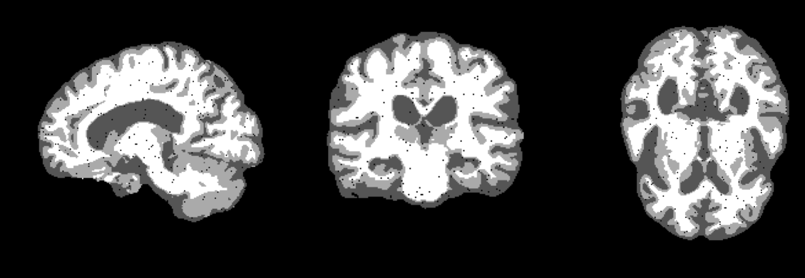

# Fill-salt-pepper-like-wrong-3D-segmentation-labels
## Intro
For 3D medical segmentation labels with foreground containing incorrect background class.  
This may be due to noise in the image causing the segmentation model to incorrectly infer some "holes" in the foreground.

## Usage
Only for 3d images of ndarray now.  
--*threshold*: The threshold is used to control the maximum number of classes 0 contained within the window, and only voxels that do not exceed this threshold are filled to avoid filling potentially reasonable background areas.  
--*strategy*: Fill in incorrect class 0 using nearest neighbor or majority voting.  
--*verbose*: Display the process.  

## Examples
 
 
